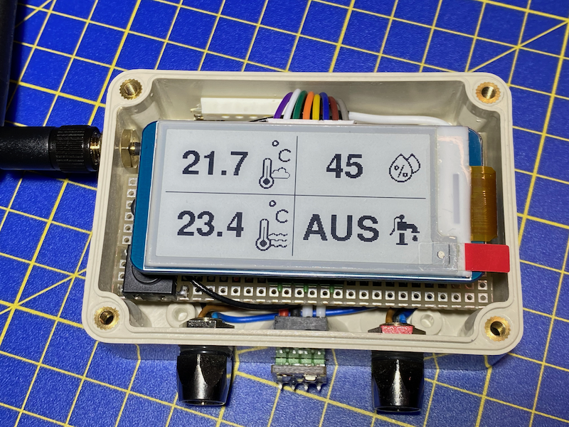

# Lotus HomeKit Monitoring

This project is about monitoring my Lotus plant which is located in a 90 litres bucket in my garden.

Cultivating a Louts plant is not that easy. This plant needs clear water and if you want to get a blossum, a specific time of water temperature above 20 degrees Celsius. In the Winter it also must not freeze.
Therefor I decided to build a small ESP32 project which monitors the water temperature and gives me the possibility to control a aquarium pump to filter out the dirt.

For outside useage I build everything in an splashproof electric plastic case with external ports for power supply and the temperature sensors.

To get my monitoring project smart I am using the [HomeSpan library](https://github.com/HomeSpan/HomeSpan) for full native Apple HomeKit integration.

## Used Hardware

- **NodeMCU ESP 32S Dev Kit** ([AZ-Delivery Link](https://www.az-delivery.de/products/nodemcu-esp-32s-kit)) - the heart of the project.
- **DS18B20 water resistant** ([AZ-Delivery Link](https://www.az-delivery.de/products/2xds18b20wasserdicht)) - for measuring the water temperature.
- **GY-21 HTU21D** ([AZ-Delivery Link](https://www.az-delivery.de/products/gy-21-temperatur-sensor-modul)) - for measuring the environmental air temperature and humidity.
- **IRL 1004 Mosfet** ([Infineon product link](https://www.infineon.com/cms/de/product/power/mosfet/n-channel/irl1004/)) - for controling the water pump.
- **2x Pushbutton NO** - one for switching on/off the water pump without using an app and one for controling the HomeSpan device (e. g. reset, enable access point, ...).
- **USB 5V water pump** - for filtering the water.
- **Waveshare 2.13 inch e-paper display HAT 250x122 (V3)** ([Waveshare Wiki](https://www.waveshare.com/wiki/2.13inch_e-Paper_HAT_Manual)) - displays all information.
- **4,7 kΩ resistor** - for water temperature DATA pull up.

## Wiring

| Power supply | ESP32     | Control button | 4,7 kΩ resitor| DS18B20   | HTU21D   | IRL 1004  | Pushbutton | Water pump  | Display |
|:-------------|:----------|:--------------|:--------------|:----------|:---------|:----------|:-----------|:------------|:--------|
| 5V           | 5V        |               |               | VIN       | VIN      |           |            | 5V          |         |
| GND          | GND       | 3             |               | GND       | GND      | SOURCE    | 3          |             | GND     |
|              | P32       | 4             |               |           |          |           |            |             |         |
|              | P13       |               | R2            | DATA      |          |           |            |             |         |
|              | P22       |               |               |           | SCL      |           |            |             |         |
|              | P21       |               |               |           | SDA      |           |            |             |         |
|              | P16       |               |               |           |          | GATE      |            |             |         |
|              | P4        |               |               |           |          |           | 4          |             |         |
|              |           |               |               |           |          | DRAIN     |            | GND         |         |
|              | 3V3       |               | R1            |           |          |           |            |             | VCC     |
|              | P23       |               |               |           |          |           |            |             | DIN     |
|              | P18       |               |               |           |          |           |            |             | CLK     |
|              | P26       |               |               |           |          |           |            |             | CS      |
|              | P25       |               |               |           |          |           |            |             | DC      |
|              | P33       |               |               |           |          |           |            |             | RST     |
|              | P27       |               |               |           |          |           |            |             | BUSY    |

## Fritzing breadboard

## Construction

Building everything into such a small case was quite challenging.

The power supply port for the ESP32 and the water pump is on the bottom right of the case. The environmental sensor is located in the middle. The left port is for connecting the water temperature sensor.
The HomeSpan control button is located on the board which can be used for unpairing the device, creating a local access point, ... . For switching the water pump on/off a magnetic contact switch is used. You can use of course a simple pushbutton instead.

## Used Arduino libraries

I created my own internal [LotusDisplay library](../Lotus/src/LotusDisplay) for displaying the data much easier and better modularization. It uses the [GXEPD2 library](https://github.com/ZinggJM/GxEPD2). 

- [HomeSpan (1.7.0)](https://github.com/HomeSpan/HomeSpan)
- [DallasTemperature (3.9.0)](https://github.com/milesburton/Arduino-Temperature-Control-Library)
- [HTU2xD/SHT2x/Si70xx Library](https://github.com/enjoyneering/HTU2xD_SHT2x_Si70xx)
- [GXEPD2 (1.5.0)](https://github.com/ZinggJM/GxEPD2)

## Useful links

- ESP32 installation instructions for Arduino IDE ([ESPRESSIF How to Install](https://espressif-docs.readthedocs-hosted.com/projects/arduino-esp32/en/latest/installing.html))
- AZ-Delivery e-paper tutorials ([Part 1](https://www.az-delivery.de/en/blogs/azdelivery-blog-fur-arduino-und-raspberry-pi/e-paper-display-am-esp32-und-esp8266-teil1), [Part 2](https://www.az-delivery.de/en/blogs/azdelivery-blog-fur-arduino-und-raspberry-pi/e-paper-display-am-esp32-und-esp8266-teil-2))
- Convert images to cpp ([image2cpp](https://javl.github.io/image2cpp/))
- Free icons ([flaticon](https://www.flaticon.com/de/))

## Acknowledgements

A big thank you to my dad who always supports me with my Arduino projects and who is doing all the electronic and hardware stuff.

### Icons

- [Aqua Icons created by Sir.Vector - Flaticon](https://www.flaticon.com/de/kostenlose-icons/aqua)
- [Wolke Icons created by Freepik - Flaticon](https://www.flaticon.com/de/kostenlose-icons/wolke)
- [Celsius icons created by Freepik - Flaticon](https://www.flaticon.com/free-icons/celsius)
- [Fever icons created by Freepik - Flaticon](https://www.flaticon.com/free-icons/fever)
- [Water pump icons created by Freepik - Flaticon](https://www.flaticon.com/free-icons/water-pump)
- [Humidity icons created by Freepik - Flaticon](https://www.flaticon.com/free-icons/humidity)
